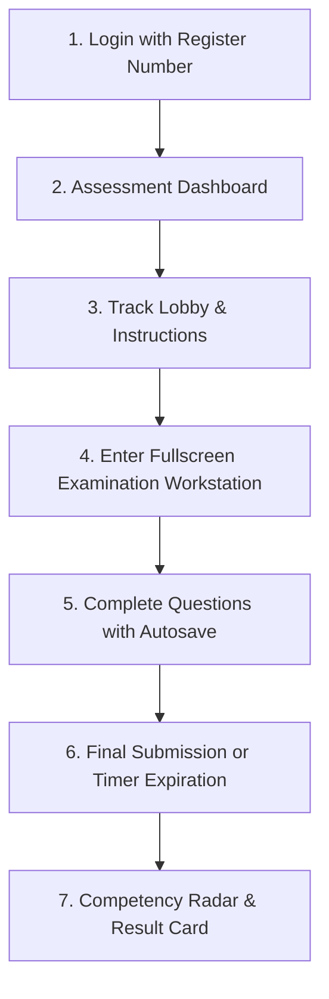

# MockRun Application Overview
**Platform Provider:** OpenLectern  
**Target Institution:** Nehru Arts and Science College (Autonomous)  
**Document Version:** 2.0.0  
**Status:** Factual Codebase Audit  

---

## 1. Product Summary
MockRun is an integrated assessment and outcome-based education (OBE) platform developed by OpenLectern for Nehru Arts and Science College (Autonomous). The application automates role-specific skill evaluations, candidate competency benchmarking, and academic performance tracking across diverse career disciplines. Students complete timed, proctored assessments using role-tailored workstations—including coding editors, interactive hardware simulation canvases, and multi-turn customer chat consoles. Institutional leaders, heads of departments (HoDs), tutors, and administrators use MockRun to manage master academic data, allocate tests, govern student attempts, and review multidimensional competency reports.

---

## 2. User Types and Permissions

| User Role | Description & Permitted Actions | Code Reference |
| :--- | :--- | :--- |
| **Student** | • View assigned assessment tracks in personal launchpad. • Launch timed rounds in a proctored environment. • Interact with specialized round workstations (MCQ, code editor, typing benchmark, chat console, IoT CAD). • View attempt scorecards, pass/fail status, and 5-axis competency radar charts. • View the academic event calendar. | [`frontend/src/pages/assessment/student/`](file:///Users/mr.s.nithishkumar/Downloads/Assessment_Portal/frontend/src/pages/assessment/student/) |
| **Class Tutor** | • Request track activations for their assigned class and semester. • Choose question complexity level (*Balanced*, *Easy*, *Medium*, *Hard*). • Bulk onboard students by uploading class roster Excel spreadsheets. • Monitor active class tests and review class performance metrics. • Grant and approve re-attempt grace tokens for candidates who missed benchmarks. | [`backend/app/routers/assessment/activation.py`](file:///Users/mr.s.nithishkumar/Downloads/Assessment_Portal/backend/app/routers/assessment/activation.py), [`frontend/src/pages/assessment/tutor/`](file:///Users/mr.s.nithishkumar/Downloads/Assessment_Portal/frontend/src/pages/assessment/tutor/) |
| **Head of Department (HoD)** | • View department-wide active assessments and student progression. • Review and approve student roster uploads submitted by tutors. • Access Cohort 360° analytics filtered to their department. • Consult the dedicated MockRun AI Executive Copilot via live WebSocket chat to query student metrics and pass rates. | [`backend/app/routers/assessment/hod.py`](file:///Users/mr.s.nithishkumar/Downloads/Assessment_Portal/backend/app/routers/assessment/hod.py), [`frontend/src/components/assistant/HodAdminChatbot.tsx`](file:///Users/mr.s.nithishkumar/Downloads/Assessment_Portal/frontend/src/components/assistant/HodAdminChatbot.tsx) |
| **Administrator** | • Full system governance across all schools, departments, and programmes. • Manage academic master data (departments, courses, batches, academic years). • Create, edit, and assign assessment domains and round policies. • Create and edit users and assign security roles. • Trigger batch AI evaluation cycles and view system audit logs. | [`backend/app/routers/master.py`](file:///Users/mr.s.nithishkumar/Downloads/Assessment_Portal/backend/app/routers/master.py), [`backend/app/routers/users.py`](file:///Users/mr.s.nithishkumar/Downloads/Assessment_Portal/backend/app/routers/users.py) |
| **Assessment / ERP Coordinator** | • Review and approve assessment activation requests across departments. • Oversee institution-level testing schedules and academic calendar milestones. • Monitor institutional OBE attainment targets. | [`backend/app/routers/assessment/admin.py`](file:///Users/mr.s.nithishkumar/Downloads/Assessment_Portal/backend/app/routers/assessment/admin.py) |
| **Faculty** | • Review class-level cohort competency radar reports and analytics. • Track syllabus milestones on the institutional calendar. | [`frontend/src/components/layout/Sidebar.tsx`](file:///Users/mr.s.nithishkumar/Downloads/Assessment_Portal/frontend/src/components/layout/Sidebar.tsx) |

---

## 3. Job Role Tracks

The application organizes tests into distinct career tracks. Below is the exact status and configuration of each track implemented in the database and codebase:

### Track 1: Software Development (`software-developer`)
*Status: Fully Implemented*

| Round # | Round Title | What It Tests | Question Format | Qs per Attempt | Qs in Bank | Time Limit | Pass Mark |
| :---: | :--- | :--- | :--- | :---: | :---: | :---: | :---: |
| **1** | Cognitive & Software Aptitude | Quantitative reasoning, logical sequences, core software logic | Multiple Choice (MCQ) | 7 | 25 | 35 mins | 65.0% |
| **2** | Programming & Coding | Algorithmic implementation, data structures, correctness | Hands-on Coding (Monaco Editor) | 2 | 2 | 60 mins | 70.0% |
| **3** | Technical Knowledge | Core computer science fundamentals, OS, networks, OOP | Technical MCQ | 7 | 30 | 45 mins | 60.0% |
| **4** | Debugging & Problem Solving | Defect localization, logic correction, edge-case fixes | Hands-on Code Debugging | 4 | 4 | 45 mins | 65.0% |

---

### Track 2: Data Analyst & Business Intelligence (`data-analyst`)
*Status: Fully Implemented*

| Round # | Round Title | What It Tests | Question Format | Qs per Attempt | Qs in Bank | Time Limit | Pass Mark |
| :---: | :--- | :--- | :--- | :---: | :---: | :---: | :---: |
| **1** | Analytical & Data Interpretation | Statistical analysis, chart interpretation, quantitative math | Data Aptitude MCQ | 7 | 10 | 35 mins | 60.0% |
| **2** | SQL + Excel + Data Extraction | Relational database querying, joins, aggregations, spreadsheet logic | SQL Query & Scenario MCQ | 7 | 10 | 50 mins | 65.0% |
| **3** | Python Analytics & Algorithmic Coding | Data manipulation scripts, algorithms, data cleaning logic | Python Coding, Debugging & MCQ | 7 | 15 | 35 mins | 60.0% |
| **4** | Tableau Studio & Visual Analytics | Dashboard design principles, visual KPI storytelling | Visual Case Study & MCQ | 7 | 7 | 45 mins | 65.0% |
| **5** | Project-Based Technical Interview | Business scenario rationale, project architecture decisions | Written Case & Text Response | 6 | 6 | 40 mins | 60.0% |

---

### Track 3: Chat Process Executive (`chat-process-executive`)
*Status: Fully Implemented*

| Round # | Round Title | What It Tests | Question Format | Qs per Attempt | Qs in Bank | Time Limit | Pass Mark |
| :---: | :--- | :--- | :--- | :---: | :---: | :---: | :---: |
| **1** | Written Communication & Typing | Grammatical precision, active voice, baseline typing speed & accuracy | Typing Speed Test & Grammar MCQ | 7 | 26 | 30 mins | 60.0% |
| **2** | Customer Judgment & De-escalation | Conflict resolution, customer empathy, escalation etiquette | Case Scenarios | 7 | 12 | 35 mins | 65.0% |
| **3** | SOP, Knowledge Base & Resolution | Navigating standard operating procedures and documentation | SOP Practical Scenarios | 7 | 15 | 40 mins | 65.0% |
| **4** | Production Post-Sales Chat Simulation | Concurrent customer ticket handling, multi-turn chat dialogues | Multi-Chat Simulation Console | 3 | 3 | 50 mins | 70.0% |

---

### Track 4: IoT Hardware Engineering (`iot-hardware-systems`)
*Status: In progress (Round 1 Built; Additional Rounds Planned)*

| Round # | Round Title | What It Tests | Question Format | Qs per Attempt | Qs in Bank | Time Limit | Pass Mark |
| :---: | :--- | :--- | :--- | :---: | :---: | :---: | :---: |
| **1** | Component Selection & Placement | Microcontroller selection, sensor AFEs, bus protocol matching, PCB pin constraints | Interactive Drag-and-Drop CAD Canvas | 2 | 17 | 20 mins | 60.0% |
| **2+** | Hardware Diagnostics & Embedded Code | *Subsequent firmware / hardware rounds* | *In progress* | — | — | — | — |

---

### Track 5: Voice Process
*Status: In progress (Not yet built in codebase)*

| Detail | Status |
| :--- | :--- |
| **Current Codebase State** | **In progress / Not yet implemented**. The customer service curriculum currently features the **Chat Process Executive** (non-voice) track. Audio capture, speech-to-text pronunciation analysis, and spoken dialogue rounds are not yet seeded or built in the examination workstation. |

---

### Complementary Master Track: C & Systems Programming (`c-programming-track`)
*Status: Fully Implemented in Database & Workstations*

| Round # | Round Title | What It Tests | Question Format | Qs per Attempt | Qs in Bank | Time Limit | Pass Mark |
| :---: | :--- | :--- | :--- | :---: | :---: | :---: | :---: |
| **1** | Foundational Quantitative Aptitude | Logic, mathematical deduction, sequence solving | Aptitude MCQ | 7 | 15 | 30 mins | 60.0% |
| **2** | C Language Syntax & Memory Fundamentals | Pointers, memory allocation, struct layouts, syntax | Technical MCQ | 7 | 15 | 30 mins | 65.0% |
| **3** | Core C Algorithmic Coding | Pointer arithmetic, dynamic memory, algorithms | C Programming (Monaco) | 3 | 63 | 45 mins | 60.0% |
| **4** | C Memory Safety & Systems Debugging | Fixing segfaults, memory leaks, buffer overruns | C Code Debugging | 2 | 62 | 35 mins | 65.0% |

---

## 4. Scoring and Results

### How Answers are Evaluated
The evaluation pipeline combines deterministic automated checks, embedded execution engines, and AI evaluation:

1. **Deterministic Objective Grading (MCQs & Scenarios):**
   - Automatically evaluated immediately upon submission.
   - Evaluates selected choices, option keys (A, B, C, D), and values against verified answer keys stored in the database.
2. **Typing Benchmark Evaluation:**
   - Evaluated automatically against typing metrics.
   - Words Per Minute (WPM) $\ge 35$ and accuracy $\ge 90\%$ yields full marks; WPM $\ge 25$ with accuracy $\ge 80\%$ yields 70% marks; lower scores receive reduced credit.
3. **Interactive Hardware CAD Evaluation:**
   - Evaluated automatically using a rules engine in [`hardware_evaluator.py`](file:///Users/mr.s.nithishkumar/Downloads/Assessment_Portal/backend/app/services/assessment/hardware_evaluator.py).
   - Verifies whether the selected component ID matches the target socket, checking power isolation, communication bus protocol compatibility (I2C, SPI, UART), and voltage levels.
4. **SQL Practical Evaluation:**
   - Evaluated by executing student SQL queries against an isolated in-memory database (`sqlite3.connect(":memory:")`) to verify query syntax and successful execution.
5. **AI Batch Code Evaluation (Coding & Debugging):**
   - Implemented via Google Gemini in [`gemini_batch_code_evaluator.py`](file:///Users/mr.s.nithishkumar/Downloads/Assessment_Portal/backend/app/services/assessment/gemini_batch_code_evaluator.py).
   - Rather than compiling code on student devices, submissions enter a `PENDING_BATCH` queue. A background worker (running every 2 hours) or manual admin trigger submits candidate code to Gemini.
   - The AI simulates test cases, checks memory management and algorithmic logic, and assigns awarded marks, pass/fail status, and diagnostic feedback.
6. **AI Subjective & Chat Simulation Evaluation:**
   - Multi-turn customer chat transcripts and descriptive business case questions are evaluated using Google Gemini in [`gemini_evaluator.py`](file:///Users/mr.s.nithishkumar/Downloads/Assessment_Portal/backend/app/services/assessment/gemini_evaluator.py) against reference rubrics (empathy, tone, resolution time, and accuracy).

### How Final Scores are Calculated
- **Round Total:** Sum of earned marks divided by maximum possible marks for the attempt, expressed as a percentage ($0.0\%$ to $100.0\%$).
- **Pass / Fail Determination:** Evaluated against the round's policy passing score (typically $60\%$ or $65\%$).
- **Readiness Classification:**
  - **Advanced:** $\ge 85\%$
  - **Proficient:** $70\% - 84.9\%$
  - **Developing:** $50\% - 69.9\%$
  - **Needs Improvement:** $< 50\%$

### What the Student Sees
Upon submission (or upon completion of batch code grading), students view a report in [`CandidateResults.tsx`](file:///Users/mr.s.nithishkumar/Downloads/Assessment_Portal/frontend/src/pages/assessment/student/CandidateResults.tsx):
- **Hero Performance Card:** Numerical score earned, total possible marks, percentage, and an official **Round Passed** or **Benchmark Not Met** badge.
- **Readiness Level:** Assigned readiness tier (e.g., *Proficient*).
- **Competency Radar Chart:** A visual 5-axis radar chart showing relative performance across tested skill categories.
- **Verified Strengths:** Explicit list of competencies where the student scored $\ge 70\%$.
- **Growth & Improvement Areas:** Targeted competencies where the student scored $< 60\%$.
- **Pending Notice:** For coding rounds awaiting the 2-hour AI cycle, a confirmation screen explains that code is timestamped and will reflect automatically once evaluated.

---

## 5. Student Journey (Step-by-Step)

1. **Authentication:** The student logs into MockRun using their institutional Register Number (e.g., `23UBCA001`) and password.
2. **Track Discovery:** The student navigates to **My Assessment Tracks**, displaying active tests allocated to their degree programme, batch, and section by their Class Tutor.
3. **Assessment Lobby:** Selecting an active track opens the assessment lobby, detailing the round title, duration, question count, and security regulations.
4. **Proctored Workstation Initialization:** Clicking **Start Assessment** initiates the round:
   - Fullscreen mode is prompted and enforced.
   - The background timer activates.
   - A random question sample matching the tutor's difficulty level is loaded into an immutable attempt snapshot.
5. **Interactive Round Execution:** The student navigates questions using the workstation built for that round:
   - *Coding/Debugging:* In-browser Monaco code editor with syntax highlighting and template code.
   - *IoT Hardware:* Drag-and-drop hardware module palette onto a motherboard PCB layout.
   - *Chat Process:* Multi-chat inbox simulation with incoming simulated tickets and an SOP reference drawer.
   - *Typing:* Live WPM and accuracy tracker.
   - *MCQ:* Option selectors.
   - Answers are continuously autosaved to the server in the background.
6. **Submission:** The student clicks **Submit Round**, or the server automatically freezes and finalizes the attempt when time expires.
7. **Performance Feedback:** The student immediately accesses their evaluation scorecard (or pending batch receipt for coding rounds), complete with the competency radar breakdown. If the benchmark is not met, the student must request a grace attempt from their Class Tutor to retake the round.

---

## 6. Admin, Tutor, and HoD Features

### Managing Students & Rosters
- **Excel Student Onboarding:** Class Tutors upload standardized `.xlsx` rosters containing student register numbers, names, emails, and phone numbers.
- **Roster Approval Workflow:** Uploaded rosters require review and approval by the Department HoD before student accounts are activated.
- **User Management Portal:** Administrators can view, filter, edit, deactivate, or reset credentials for any user account.

### Managing Questions & Question Banks
- **Domain & Round Setup:** Administrators can create new assessment tracks, configure round sequences, durations, and passing thresholds.
- **Question Versioning:** Questions support revision versioning with immutable snapshots, ensuring that in-progress student attempts are never affected by ongoing question bank edits.

### Test Governance & Activation
- **Two-Layer Role Governance:** Students cannot self-enroll. Class Tutors initiate track activations specifying target classes, activation date windows, and complexity distributions (*Balanced*, *Easy*, *Medium*, *Hard*).
- **Grace Re-Attempt Management:** Tutors can review student re-attempt requests and grant single-use grace tokens for retakes.

### Analytics, Reports & Exports
- **Cohort 360° Analytics:** Interactive charts displaying class pass rates, round completion funnels, and at-risk candidate distributions.
- **Excel Data Export:** Export student scores, attempt logs, and class roster data to spreadsheet formats.
- **Audit Logs:** System-wide audit log recording logins, data modifications, and administrative actions.

---

## 7. Assessment Integrity and Security

MockRun includes several client-side proctoring and server-side integrity controls:

1. **Client-Side Security Guard ([`SecurityGuard.tsx`](file:///Users/mr.s.nithishkumar/Downloads/Assessment_Portal/frontend/src/components/assessment/SecurityGuard.tsx)):**
   - **Tab & Window Switch Interception:** Listens to `document.hidden` and `window.blur`. If a candidate navigates away or switches windows, the screen displays a blackout overlay, and the clipboard is purged.
   - **Context Menu & Clipboard Restriction:** Right-click menus, copying (`Ctrl+C`), cutting (`Ctrl+X`), and pasting (`Ctrl+V`) are blocked.
   - **Screenshot & Shortcut Blocking:** Intercepts `PrintScreen`, `Win+Shift+S`, `Cmd+Shift+4`, and `Ctrl+P` (Print to PDF).
   - **DevTools Blocking:** Intercepts `F12`, `Ctrl+Shift+I`, `Ctrl+Shift+J`, and `Ctrl+U` (view source).
   - **Voice Typing Neutralization:** Disables Web Speech APIs and blocks `Win+H` voice typing shortcuts.
   - **Third-Party AI Extension Defense:** Uses CSS rules and a active `MutationObserver` to strip injected popups and iframes from browser AI extensions (e.g., ChatGPT, Gemini, Copilot).
2. **Fullscreen Enforcement ([`FullscreenGuard.tsx`](file:///Users/mr.s.nithishkumar/Downloads/Assessment_Portal/frontend/src/components/assessment/FullscreenGuard.tsx)):**
   - Mandates HTML5 fullscreen mode before test entry and alerts candidates upon exit.
3. **Server-Side Frozen Deadlines & Timers ([`timing.py`](file:///Users/mr.s.nithishkumar/Downloads/Assessment_Portal/backend/app/services/assessment/timing.py)):**
   - Exam deadlines are calculated on the server at attempt creation. Client clock tampering cannot extend the exam duration.
4. **Question Randomization & Snapshots ([`attempt_service.py`](file:///Users/mr.s.nithishkumar/Downloads/Assessment_Portal/backend/app/services/assessment/attempt_service.py)):**
   - Questions are randomly sampled from the bank based on the tutor's selected complexity level.
   - Each attempt freezes question data into an immutable snapshot, preventing answer tampering.
5. **Attempt Constraints:**
   - Single attempt by default. Retakes require an explicit tutor approval token.
6. **Proctoring Implementation Status:**
   - **Active:** Client-side lockouts, tab-switch detection, fullscreen enforcement, and server-side timers.
   - **In progress:** While computer vision libraries (`opencv-python`, `ultralytics`) are present in environment configurations and test scripts, live webcam video streaming and AI face/phone detection are not yet wired into the active exam runner.

---

## 8. AI and Machine Learning Features

| AI Component | Underlying Model / Technology | Function in Application | Code Location |
| :--- | :--- | :--- | :--- |
| **Batch Code Evaluator** | Google Gemini (`gemini-3.1-flash-lite`, `gemini-2.5-flash-lite`) | Evaluates pending student code and debugging solutions in scheduled batches. Checks algorithmic correctness, memory safety, test cases, and compiler diagnostics. | [`gemini_batch_code_evaluator.py`](file:///Users/mr.s.nithishkumar/Downloads/Assessment_Portal/backend/app/services/assessment/gemini_batch_code_evaluator.py) |
| **Simulation Transcript Evaluator** | Google Gemini | Evaluates multi-turn customer chat transcripts and text responses against rubrics assessing empathy, tone, resolution time, and accuracy. | [`gemini_evaluator.py`](file:///Users/mr.s.nithishkumar/Downloads/Assessment_Portal/backend/app/services/assessment/gemini_evaluator.py) |
| **Autonomous Executive AI Copilot** | Google Gemini (`gemini-3.1-flash-live-preview`) | An interactive conversational assistant for HoDs and Admins. Operates over WebSockets and can query the database in read-only mode to summarize student scores, class performance, and pass rates. | [`master_agent.py`](file:///Users/mr.s.nithishkumar/Downloads/Assessment_Portal/backend/app/services/assistant/master_agent.py), [`gateway.py`](file:///Users/mr.s.nithishkumar/Downloads/Assessment_Portal/backend/app/services/assistant/gateway.py) |
| **AI Video Proctoring** | OpenCV & Ultralytics (YOLO) | *In progress / Standalone Test Suite*. Automated frame detection for mobile phones and webcam anomalies during tests. | [`backend/test_proctoring.py`](file:///Users/mr.s.nithishkumar/Downloads/Assessment_Portal/backend/test_proctoring.py) |

---

## 9. Technology Stack

### Frontend
- **Framework & Runtime:** React 19, TypeScript
- **Build Tool:** Vite 8
- **Styling:** Vanilla CSS, Tailwind CSS (v4)
- **Code Editor:** Monaco Editor (`@monaco-editor/react`)
- **Data Visualization:** Recharts
- **Icons & UI:** Lucide React, Canvas Confetti
- **HTTP & Utilities:** Axios, es-toolkit, SheetJS (`xlsx`)

### Backend
- **Framework:** FastAPI (Python 3.9+)
- **Server:** Uvicorn (ASGI multi-worker)
- **Database ORM:** SQLAlchemy 2.0
- **Validation:** Pydantic 2.0
- **Security & Tokens:** Python-Jose (JWT), Passlib, Bcrypt
- **Asynchronous Communication:** WebSockets, HTTPX

### Database
- **Database Engine:** PostgreSQL (Cloud-hosted on Supabase)
- **Connection Driver:** Psycopg2-binary
- **Embedded In-Memory Engine:** SQLite (used for practical SQL test query verification)

### Third-Party & Cloud Services
- **AI Services:** Google Gemini API (Flash Lite, Flash, Flash Live Preview)
- **Cloud Database:** AWS Supabase Cloud Pooler

---

## 10. Distinctive Codebase Highlights

1. **Interactive IoT Hardware Drag-and-Drop CAD Workstation:**
   - *Code Reference:* [`ComponentPalette.tsx`](file:///Users/mr.s.nithishkumar/Downloads/Assessment_Portal/frontend/src/components/assessment/workstations/ComponentPalette.tsx), [`MotherboardCanvas.tsx`](file:///Users/mr.s.nithishkumar/Downloads/Assessment_Portal/frontend/src/components/assessment/workstations/MotherboardCanvas.tsx), [`hardware_evaluator.py`](file:///Users/mr.s.nithishkumar/Downloads/Assessment_Portal/backend/app/services/assessment/hardware_evaluator.py)
   - Rather than simple MCQs, IoT candidates place microcontrollers, sensors, transceivers, and power units onto a virtual PCB motherboard, validated against electrical and communication bus constraints.
2. **Multi-Turn Customer Support Console Simulator:**
   - *Code Reference:* [`ChatRound4SupportConsole.tsx`](file:///Users/mr.s.nithishkumar/Downloads/Assessment_Portal/frontend/src/pages/assessment/student/workstations/chat/ChatRound4SupportConsole.tsx)
   - Simulates a real-time post-sales support desk where students manage multiple customer tickets, review SOP documents, and send responses that are evaluated by AI against empathy and speed criteria.
3. **Decoupled Asynchronous Batch AI Code Evaluation:**
   - *Code Reference:* [`gemini_batch_code_evaluator.py`](file:///Users/mr.s.nithishkumar/Downloads/Assessment_Portal/backend/app/services/assessment/gemini_batch_code_evaluator.py), [`backend/app/main.py`](file:///Users/mr.s.nithishkumar/Downloads/Assessment_Portal/backend/app/main.py#L22-L36)
   - Replaces in-browser compilers with an asynchronous queue evaluated every 2 hours by Gemini, providing simulated test runs and qualitative diagnostics.
4. **Autonomous AI Executive Copilot with Read-Only Database Tools:**
   - *Code Reference:* [`master_agent.py`](file:///Users/mr.s.nithishkumar/Downloads/Assessment_Portal/backend/app/services/assistant/master_agent.py), [`tools.py`](file:///Users/mr.s.nithishkumar/Downloads/Assessment_Portal/backend/app/services/assistant/tools.py)
   - HoDs and administrators can query an AI assistant over WebSockets that autonomously writes and executes read-only SQL queries to retrieve real-time student and class metrics.
5. **Multi-Vector Competency Radar & Readiness Indexing:**
   - *Code Reference:* [`CompetencyRadar.tsx`](file:///Users/mr.s.nithishkumar/Downloads/Assessment_Portal/frontend/src/components/assessment/CompetencyRadar.tsx), [`scoring_service.py`](file:///Users/mr.s.nithishkumar/Downloads/Assessment_Portal/backend/app/services/assessment/scoring_service.py)
   - Maps student performance to 5 core competencies, displaying a visual radar profile and automatically identifying specific strengths and growth areas.
6. **Anti-Extension & Proctoring Security Guard:**
   - *Code Reference:* [`SecurityGuard.tsx`](file:///Users/mr.s.nithishkumar/Downloads/Assessment_Portal/frontend/src/components/assessment/SecurityGuard.tsx)
   - Features a active `MutationObserver` that actively detects and removes injected popups or iframes from browser AI extensions (like ChatGPT and Copilot) during the examination.
7. **Two-Layer Role Governance & Grace Attempt Control:**
   - *Code Reference:* [`authorization.py`](file:///Users/mr.s.nithishkumar/Downloads/Assessment_Portal/backend/app/services/assessment/authorization.py), [`activation.py`](file:///Users/mr.s.nithishkumar/Downloads/Assessment_Portal/backend/app/routers/assessment/activation.py)
   - Assessments require formal tutor activation, and retakes are gated behind single-use grace tokens, preventing unapproved attempts.

---

## 11. Current Limitations and In-Progress Features

1. **Voice Process Track (In Progress / Not Yet Built):**
   - The Voice Process track is not currently present in the database or frontend. Non-voice customer support is handled via the Chat Process track.
2. **IoT Track Round Breadth (In Progress):**
   - Only Round 1 (*Component Selection and Placement*) is currently seeded and functional. Later rounds (firmware, debugging, hardware diagnostics) remain in progress.
3. **Webcam AI Proctoring (In Progress):**
   - While OpenCV and Ultralytics dependencies are installed and test scripts exist, real-time webcam streaming and AI facial/mobile detection are not yet integrated into the student exam workstation.
4. **Isolated Sandboxed Execution (Judge0 / Docker):**
   - Hands-on coding rounds currently rely on Gemini AI simulation or in-memory execution rather than isolated container sandboxes.
5. **Self-Registration:**
   - There is no public student sign-up page; all student accounts must be onboarded via tutor Excel upload or administrative master data entry.
